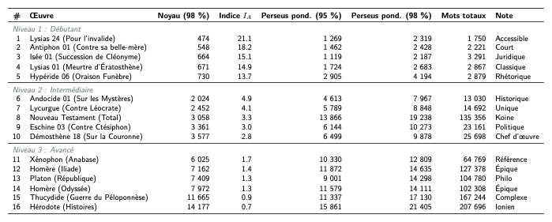

# Vocabulaire fréquentiel et indice d'apprenabilité (grec ancien)

Ce dépôt héberge les scripts et les données permettant de générer une liste fréquentielle lemmatisée du Grec Ancien, fondée non seulement sur les occurrences brutes, mais aussi sur un **Indice d'Apprenabilité**.

L'objectif de ce projet est de proposer une progression lexicale réaliste aux étudiants. Plutôt que de subir la surreprésentation des mots issus des œuvres les plus volumineuses (comme l'Iliade ou les Histoires d'Hérodote), notre matrice pondère le vocabulaire selon son utilité pour aborder les textes dont le "noyau lexical" est le plus restreint.

## Approche : le score de facilité

L'indice d'apprenabilité ($I_A$) d'une œuvre est calculé selon la taille de son noyau lexical. Le **Noyau Lexical** (noté $N_{98}$) est défini comme le nombre de mots (lemmes) uniques qu'un lecteur doit connaître pour comprendre **98 %** de l'œuvre.



La formule mathématique du score de facilité intégrée au modèle est :

$$I_A(T) = \frac{10000}{N_{98}(T)}$$

Les mots sont ensuite pondérés par leur fréquence relative dans chaque texte multipliée par l'indice du texte, permettant ainsi de redonner de l'importance au vocabulaire des textes pédagogiquement accessibles (Ex: Les discours de Lysias ou le Nouveau Testament).

---

## Structure du dépôt

L'architecture du code a été pensée pour être propre et modulaire. 

```
.
├── scripts/                    # Scripts d'analyse principaux
│   ├── analyze_frequency.py       # Génère la liste pondérée et les statistiques
│   ├── calculate_perseus_ranks.py # Calcule les rangs (95% / 98%) par œuvre
│   └── data_collection/           # Scripts de téléchargement des textes
│       ├── download_texts.py
│       ├── download_more.py
│       └── ...
├── data/                       # Textes XML (TEI) et SBLGNT bruts (générés par data_collection)
├── results/                    # Résultats générés (fichiers CSV, rapports)
│   ├── perseus_weighted.csv       # La liste de fréquence scientifiquement pondérée
│   ├── perseus_frequency.csv      # La liste classique de Perseus (fréquences brutes)
│   └── frequency_report.md        # Rapport complet des statistiques par œuvre
└── visuals/                    # Code source des rendus graphiques (LaTeX, HTML, PNG)
    ├── frequency_table.tex
    ├── table_visualization.html
    └── frequency_table_simple.png
```

---

## Utilisation universelle

La suite d'analyse peut être exécutée sur n'importe quel ordinateur disposant de Python 3.

### 1. Installation des dépendances

Le projet s'appuie sur `Stanza` pour la lemmatisation de pointe (qui filtre les noms propres et les erreurs OCR) et `requests` pour le téléchargement.

```bash
pip install requests stanza
```

### 2. Téléchargement des corpus

Il suffit d'exécuter les scripts depuis la racine du projet pour rapatrier les œuvres au format XML :

```bash
python3 scripts/data_collection/download_texts.py
python3 scripts/data_collection/download_more.py
python3 scripts/data_collection/download_attic_orators.py
```
Le dossier `data/` sera alors rempli.

### 3. Exécution de l'analyse fréquentielle

Ce script lemmatise le corpus complet (ce qui peut prendre plusieurs dizaines de minutes), calcule l'indice d'apprenabilité pour toutes les œuvres et exporte les listes : 

```bash
python3 scripts/analyze_frequency.py
```

### 4. Calcul des rangs

Pour déterminer à quel moment de l'apprentissage (en nombre de mots) une œuvre devient accessible (95% de couverture) et fluide (98%), lancez :

```bash
python3 scripts/calculate_perseus_ranks.py
```

---

## Résultats et visualisation

Le résultat de cette pondération bouleverse les méthodes traditionnelles d'apprentissage fondées sur Perseus. On observe que le dialecte ionien d'Homère cède le sommet de la liste au profit du vocabulaire judiciaire attique et de la narration de la Koinè, beaucoup plus rentables pour un étudiant débutant. 

Tous les résultats de classement sont observables de manière syntaxique ou compilée dans le dossier `visuals/`.

### Crédits
*Code et recherche originaux par [Luc Pommeret](https://lucpommeret.com) et [Thibault Wagret](https://thibaultwagret.fr).*
