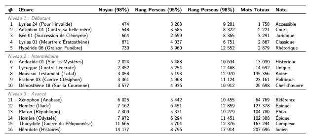

# Analyse de Fréquence en Grec Ancien

Ce projet a pour objectif de déterminer le nombre de mots (lemmes) uniques nécessaires pour comprendre 98% de divers textes classiques grecs. Il compare également le vocabulaire de chaque œuvre à un "corpus de référence" (basé sur l'ensemble des textes analysés) pour évaluer la standardisation du vocabulaire.

## 📊 Résultats Clés

Voici le tableau récapitulatif des lemmes nécessaires pour atteindre 98% de couverture.



**Observations principales :**
*   **Accessibilité :** Le **Nouveau Testament** est remarquablement accessible (seulement ~3 000 mots pour comprendre 98% du texte), malgré sa longueur.
*   **Complexité :** Les historiens comme **Hérodote** et **Thucydide** exigent un vocabulaire très étendu (plus de 11 000 mots).
*   **Standards :** L'**Anabase** de Xénophon et la **République** de Platon sont les textes les plus proches du vocabulaire "standard" du corpus, ce qui en fait d'excellents points d'entrée pour l'apprentissage du grec classique.

## 🚀 Utilisation

Pour reproduire l'analyse, suivez ces étapes :

### 1. Installation des dépendances
Le projet utilise Python 3.
Veuillez installer les bibliothèques requises :

```bash
pip install requests stanza
```

### 2. Téléchargement des Textes
Exécutez les scripts de téléchargement pour récupérer les œuvres depuis Perseus et d'autres sources (fichiers XML TEI et SBLGNT).

```bash
# Téléchargement des textes principaux (Iliade, Odyssée, République, etc.)
python3 download_texts.py

# Téléchargement du corpus étendu (Hérodote, Démosthène, Nouveau Testament complet)
python3 download_more.py
```

Ces scripts créeront un dossier `data/` et y placeront les fichiers nécessaires.

### 3. Lancer l'Analyse
Une fois les textes téléchargés, lancez le script d'analyse. Il se chargera de :
1.  Télécharger le modèle de lemmatisation pour le grec ancien (`stanza`).
2.  Lemmatiser l'ensemble des textes.
3.  Calculer les fréquences et les seuils de couverture (98%).
4.  Générer le rapport (`frequency_report.md`) et la liste de fréquence globale (`perseus_frequency.csv`).

```bash
python3 analyze_frequency.py
```

Le processus peut prendre quelques minutes en fonction de la puissance de votre machine (le téléchargement des modèles et la lemmatisation sont intensifs).

## 📂 Fichiers Générés
*   `frequency_report.md` : Le rapport détaillé (Markdown).
*   `perseus_frequency.csv` : La liste de fréquence de tout le corpus (utile pour créer des flashcards).
*   `table_visualization.html` & `frequency_table_simple.png` : Visualisation des données.
